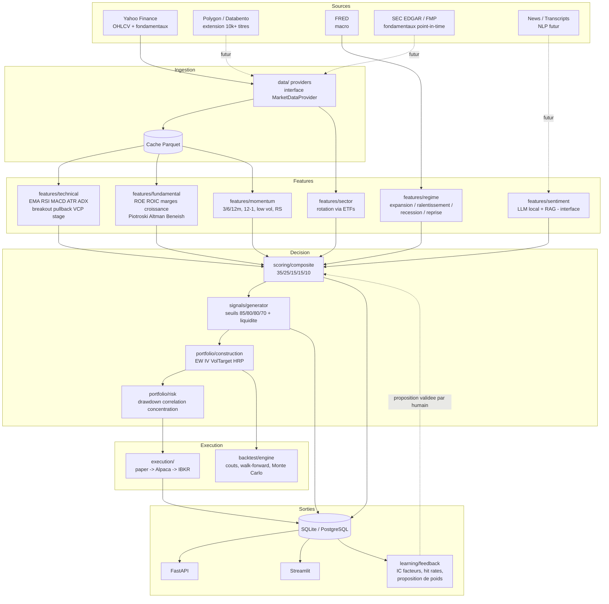
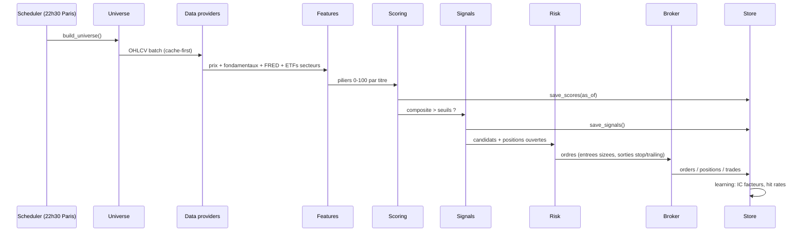

# Architecture ATLAS

## Vue d'ensemble

## Flux quotidien (pipeline daily_scan)

## Principes de conception

1. **Aucun vendor lock-in**: tout fournisseur de donnees implemente
   `MarketDataProvider` (data/base.py). Yahoo est le fallback gratuit;
   Polygon/Databento se branchent sans toucher au reste.
2. **Configuration = source de verite**: ponderations, seuils et contraintes
   vivent dans `config/config.yaml`. Le code ne contient aucun nombre magique
   de strategie. Le module learning PROPOSE des changements, un humain les
   applique (phases 1-2).
3. **Degradation gracieuse**: pas de cle FRED -> regime neutre (50). Pas de
   fondamentaux -> score neutre. Le pipeline ne casse jamais sur une donnee
   manquante; il degrade le score vers la neutralite.
4. **Separation decision / execution**: le moteur de scoring ne sait pas qui
   execute. Le broker ne sait pas pourquoi il achete. Le risk manager peut
   couper les deux.
5. **Garde-fous en dur**: tout broker non-paper exige `LIVE_TRADING_ACK` dans
   l'environnement. Les chemins critiques (sizing, stops) sont testes.

## Scalabilite (10 000+ actifs)

| Composant | MVP (aujourd'hui) | Production |
|-----------|-------------------|------------|
| Prix | Yahoo, ~1500 titres, sequentiel | Polygon flat files / Databento, ingestion parallele |
| Fondamentaux | Yahoo snapshot | FMP as-reported + EDGAR (point-in-time) |
| Stockage | SQLite + Parquet | PostgreSQL + Parquet partitionne (ou TimescaleDB) |
| Calcul features | boucle pandas | vectorisation wide-frame + Polars, workers paralleles |
| Orchestration | boucle docker / cron | Airflow ou Prefect, retries, SLA |
| Cache chaud | Parquet local | Redis (deja dans docker-compose) |

Le scoring cross-sectionnel est deja vectorise (DataFrame entier), seule la
collecte par ticker est sequentielle: c'est le point de parallelisation prevu.
